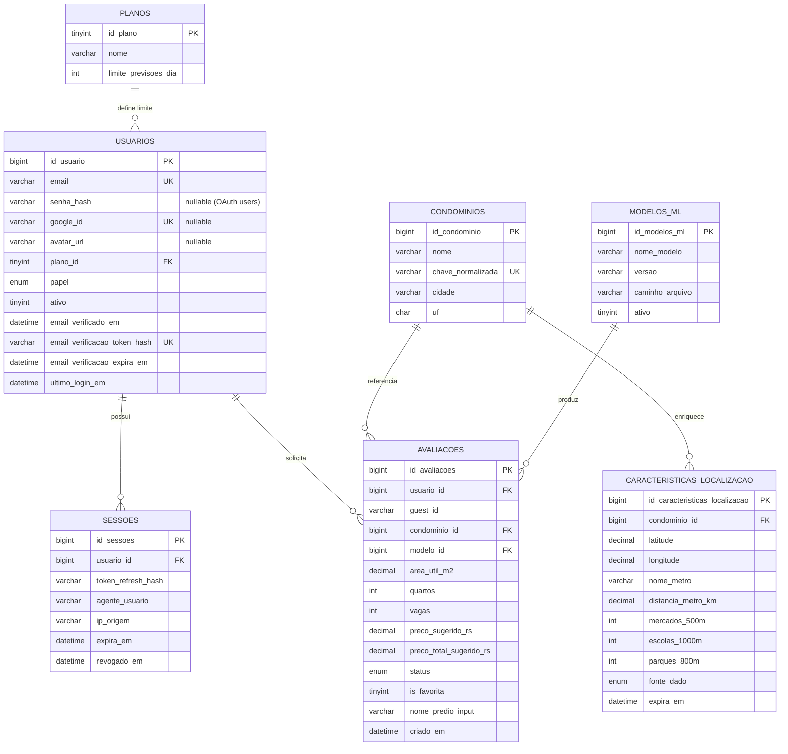

# PrevIsmob — Arquitetura

Documento técnico sobre a estrutura interna do PrevIsmob, fluxos de navegação, contrato dos endpoints e decisões de projeto. Para visão geral e setup, ver [README.md](README.md). Para testes, ver [README_TESTES.md](README_TESTES.md).

---

## Sumário

- [Objetivo da arquitetura](#objetivo-da-arquitetura)
- [Componentes](#componentes)
- [Estrutura de pastas](#estrutura-de-pastas)
- [Fluxos de navegação e estado](#fluxos-de-navegação-e-estado)
- [Fluxo de quota](#fluxo-de-quota)
- [Google OAuth 2.0](#google-oauth-20)
- [Histórico e comparação](#histórico-e-comparação)
- [Comportamento com falhas de serviços externos](#comportamento-com-falhas-de-serviços-externos)
- [Endpoints principais](#endpoints-principais)
- [Modelo de dados](#modelo-de-dados)
- [Versionamento de API](#versionamento-de-api)
- [Decisões técnicas](#decisões-técnicas)
- [Segurança](#segurança)
- [Observabilidade](#observabilidade)
- [Pontos de atenção para manutenção](#pontos-de-atenção-para-manutenção)

---

## Objetivo da arquitetura

- Separar **frontend estático** de **backend de domínio** para permitir deploy independente.
- Concentrar regras de negócio (cotas, auth, persistência, modelagem) no backend, mantendo o frontend "burro" — apenas UI + chamadas REST.
- Permitir uso público (guest) com fricção mínima e habilitar features ricas (histórico, comparação, export) apenas após autenticação verificada.
- Cachear o enriquecimento geográfico (Google Maps) por condomínio com TTL de 90 dias (`caracteristicas_localizacao.expira_em`), reduzindo chamadas repetidas à API externa.

---

## Componentes

```
┌────────────────────────────── Frontend (estático) ──────────────────────────────┐
│                                                                                 │
│   index.html    ─►  landing + auth (login, cadastro, Google OAuth)              │
│   previsao.html ─►  formulário de previsão + resultado                          │
│   historico.html─►  histórico de avaliações e comparação                        │
│   comparar.html ─►  comparação lado a lado + exportação CSV/PDF                 │
│   script.js     ─►  estado client-side compartilhado (auth, intent pós-login)   │
│   style.css     ─►  tema único, mobile-first                                    │
└────────────────────────────────────┬────────────────────────────────────────────┘
                                     │ fetch JSON + cookie httpOnly (guest_id)
                                     ▼
┌────────────────────────────── Backend FastAPI ──────────────────────────────────┐
│   api.py                                                                        │
│   ├── /v1/auth/*           → registro, verificação, login, refresh, logout, me  │
│   ├── /v1/auth/google      → login/cadastro via Google OAuth (ID Token)         │
│   ├── /v1/prever           → orquestra Maps + ML + persistência + cota          │
│   ├── /v1/quota            → estado atual da cota (guest/auth)                  │
│   ├── /v1/historico        → lista avaliações do usuário                        │
│   ├── /v1/comparar         → múltiplas avaliações lado a lado                   │
│   ├── /v1/export/{csv,pdf} → exportação                                         │
│   ├── /v1/condominio       → autocomplete (dataset CSV)                         │
│   ├── /v1/status           → metadados / healthcheck                            │
│   └── /, /previsao, /historico, /comparar, /docs → páginas HTML e Swagger      │
│                                                                                 │
│   email_service.py  → tokens de verificação + envio (SMTP ou dev-mode)          │
│   modelo_imoveis.pkl → estimador scikit-learn carregado via joblib              │
└────────────────────────────────────┬────────────────────────────────────────────┘
                                     │
                  ┌──────────────────┼──────────────────┐
                  ▼                  ▼                  ▼
           Google Maps API       MySQL 8.x         Filesystem
        (Geocoding + Places)   (usuários, sessões,  (modelo .pkl,
                                avaliações,         CSVs auxiliares)
                                condomínios,
                                features, modelos)
```

---

## Estrutura de pastas

```text
Prevismob/
├── api.py                         # Backend FastAPI (rotas + regras de negócio)
├── email_service.py               # Tokens + envio de e-mail de verificação
├── modelo_imoveis.pkl             # Modelo ML treinado (joblib)
├── treinar_ia.py                  # Script de treino offline
├── static/
│   ├── index.html                 # Landing + autenticação (Google OAuth incluso)
│   ├── previsao.html              # Formulário de previsão e resultado
│   ├── historico.html             # Histórico e navegação
│   ├── comparar.html              # Comparação lado a lado + exportação CSV/PDF
│   ├── script.js                  # Estado client-side compartilhado
│   └── style.css                  # Tema visual
├── requirements.txt               # Dependências de runtime da API
├── requirements-train.txt         # Dependências extras para treino/scripts
├── data/
│   └── dataset_aguas_claras_completo.csv
├── processamento/                 # Datasets intermediários (offline)
├── scripts/                       # Coletores e utilitários offline
├── migrations/                    # SQLs idempotentes (também aplicadas em runtime)
└── tests/                         # Suite pytest
```

---

## Fluxos de navegação e estado

### Páginas e rotas de frontend

O frontend é composto de **4 páginas HTML independentes**, servidas pelo próprio backend FastAPI via `FileResponse` e `StaticFiles`:

- `index.html` — landing pública + autenticação (login, cadastro, Google OAuth).
- `previsao.html` — formulário de previsão e resultado; aceita guest ou auth.
- `historico.html` — histórico de avaliações e links para comparação.
- `comparar.html` — comparação lado a lado de 2 avaliações + exportação CSV/PDF.

`script.js` (compartilhado) gerencia apenas estado de auth e navegação na landing. Cada página tem seu próprio JS inline para operações de domínio. A landing (`/`) é sempre o ponto de entrada padrão.

### Guest vs. Auth

| Estado | Identificação                                                          | Cota             | Recursos disponíveis                        |
| ------ | ---------------------------------------------------------------------- | ---------------- | ------------------------------------------- |
| Guest  | Cookie `prevismob_guest_id` (UUID v4, httpOnly) ou fallback hash IP+UA | 2 previsões/dia  | `/v1/prever`, `/v1/quota`, `/v1/condominio` |
| Auth   | JWT Bearer (access 15min) + refresh (7d, hash em `sessoes`)            | 10 previsões/dia | Tudo do guest + histórico, comparar, export |

A landing detecta o estado pela presença/validade do access token e ajusta a navbar (`data-auth-state="guest|auth"`).

### Pós-login por intenção

Após login bem-sucedido, o frontend usa a variável `pendingPostLoginNext` para decidir o destino:

- `next = "landing"` (default) — usuário fez login a partir da landing pública e volta para a **landing logada** (com nav atualizada). Comportamento esperado quando o login é casual e o usuário ainda não decidiu prever nada.
- `next = "app"` — usuário acionou o login após tentar uma ação que exige autenticação (ex.: clicou em **Avaliar Imóvel** sem estar logado). Após o login, o frontend navega para `/previsao`.

> Trecho de referência em [`static/script.js`](static/script.js). Tokens inválidos/expirados não derrubam a landing pública: `get_optional_user` no backend retorna `None` silenciosamente.

---

## Fluxo de quota

- **Guest:** 2 previsões com `status='SUCESSO'` por dia, contadas por `guest_id`.
- **Auth:** 10 previsões com `status='SUCESSO'` por dia, contadas por `usuario_id`.
- "Dia" = `CURDATE()` no MySQL (timezone do servidor).
- **Falhas não consomem cota.** Apenas inserts com `status='SUCESSO'` em `avaliacoes` contam.
- Quando excedida:
  - HTTP **429** com payload `{daily_limit, used_today, remaining_today, limit_reached: true, ...}`.
  - Header `Retry-After` com segundos até a próxima meia-noite do servidor.
- Endpoint `/quota` retorna o mesmo payload sem efetuar previsão — usado para hidratar o badge na UI.
- Após login, o frontend **re-busca `/quota`** para sincronizar o badge (o limite muda de 2 para 10 instantaneamente).

Configurável via `DAILY_LIMIT_GUEST` e `DAILY_LIMIT_AUTH` no `.env`.

---

## Google OAuth 2.0

O login social usa **Google Identity Services** no frontend e verificação server-side do ID Token.

### Fluxo

1. Frontend renderiza o botão Google Sign-In (GIS SDK) na tela de login/cadastro.
2. Usuário autoriza → GIS retorna um `credential` (ID Token JWT assinado pelo Google).
3. Frontend envia `POST /v1/auth/google` com `{"id_token": "<credential>"}`.
4. Backend valida o ID Token via `google-auth` (`google.oauth2.id_token.verify_oauth2_token`), usando `GOOGLE_CLIENT_ID` como audience.
5. Se válido: cria usuário (se não existir) ou autentica usuário existente; retorna `access_token` e `refresh_token`.
6. `senha_hash` fica `NULL` em usuários criados via OAuth — não possuem senha local.
7. Conta OAuth é marcada como verificada automaticamente (sem etapa de e-mail).

### Variáveis necessárias

- `GOOGLE_CLIENT_ID` — Client ID do projeto no Google Cloud Console (OAuth 2.0 → Credentials).
- Não requer `GOOGLE_CLIENT_SECRET` (fluxo é ID Token, não code exchange).

---

## Histórico e comparação

- Histórico acessível via página dedicada `/historico` (auth obrigatória). A landing não exibe dados pessoais.
- Endpoint backing: `GET /v1/historico`.
- Cada item permite:
  - Selecionar para comparação → navega para `/comparar?ids=ID1,ID2`.
  - Exportar a lista visível em CSV/PDF → `GET /v1/export/csv` ou `/v1/export/pdf`.

---

## Comportamento com falhas de serviços externos

| Serviço      | Falha                                         | Resposta da API                                                                               |
| ------------ | --------------------------------------------- | --------------------------------------------------------------------------------------------- |
| Google Maps  | Chave inválida, billing desabilitado, timeout | `502 Bad Gateway` com campo `detail` descrevendo a causa (`BILLING_DISABLED`, `INVALID_KEY`). |
| MySQL        | Indisponível no boot ou na requisição         | `503 Service Unavailable`; a API sobe mas rotas que dependem de DB retornam 503.              |
| Google OAuth | `GOOGLE_CLIENT_ID` ausente                    | `503 Service Unavailable`.                                                                    |
| Google OAuth | ID Token inválido ou expirado                 | `401 Unauthorized`.                                                                           |

---

## Endpoints principais

| Método   | Rota                            | Auth                       | Propósito                                                          |
| -------- | ------------------------------- | -------------------------- | ------------------------------------------------------------------ |
| `POST`   | `/v1/auth/register`             | Pública                    | Cria usuário + envia e-mail de verificação.                        |
| `GET`    | `/v1/auth/verificar-email`      | Pública (token na query)   | Marca conta como verificada.                                       |
| `POST`   | `/v1/auth/reenviar-verificacao` | Pública                    | Reenvia link (cooldown configurável).                              |
| `POST`   | `/v1/auth/login`                | Pública                    | Retorna access + refresh; bloqueia se não verificado.              |
| `POST`   | `/v1/auth/google`               | Pública                    | Login/cadastro via Google OAuth (ID Token server-side).            |
| `POST`   | `/v1/auth/refresh`              | Pública (com refresh)      | Rotaciona refresh + emite novo access.                             |
| `POST`   | `/v1/auth/logout`               | Pública (com refresh)      | Revoga sessão.                                                     |
| `GET`    | `/v1/auth/me`                   | Bearer                     | Dados do usuário corrente.                                         |
| `DELETE` | `/v1/auth/me`                   | Bearer                     | Exclusão (anonimização) da conta do usuário autenticado.           |
| `GET`    | `/`                             | Pública                    | Landing (index.html).                                              |
| `GET`    | `/previsao`                     | Pública                    | Página de previsão (previsao.html).                                |
| `GET`    | `/historico`                    | Pública                    | Página de histórico (historico.html).                              |
| `GET`    | `/comparar`                     | Pública                    | Página de comparação (comparar.html).                              |
| `GET`    | `/docs`                         | Pública                    | Swagger UI.                                                        |
| `GET`    | `/v1/status`                    | Pública                    | Indica se o modelo carregou.                                       |
| `GET`    | `/v1/condominio`                | Pública                    | Autocomplete de nomes (dataset CSV).                               |
| `POST`   | `/v1/prever`                    | Opcional (Bearer ou guest) | Previsão; consome cota; persiste em `avaliacoes` se DB disponível. |
| `GET`    | `/v1/quota`                     | Opcional                   | Estado da cota (auth ou guest).                                    |
| `GET`    | `/v1/historico`                 | Bearer                     | Avaliações do usuário corrente (JSON).                             |
| `GET`    | `/v1/comparar`                  | Bearer                     | Compara avaliações por IDs (JSON).                                 |
| `GET`    | `/v1/export/csv`                | Bearer                     | Histórico em CSV.                                                  |
| `GET`    | `/v1/export/pdf`                | Bearer                     | Histórico em PDF.                                                  |

> A lista exata de parâmetros e schemas Pydantic está em `/docs` (gerado a partir do código). Quando houver dúvida, **verifique no código**: `api.py`.

---

## Modelo de dados

O backend persiste em **MySQL 8.x** (engine `InnoDB`, charset `utf8mb4_unicode_ci`). O schema completo, exportado diretamente do banco em uso, encontra-se em [docs/db/schema.sql](docs/db/schema.sql) e é a **única fonte de verdade** desta seção. As migrações em [migrations/](migrations/) cobrem apenas alterações incrementais aplicadas após a criação inicial do schema.

### Diagrama entidade-relacionamento



### Tabelas e finalidade funcional

| Tabela                        | Finalidade                                                                                                                                                                                                                                                                                                                        |
| ----------------------------- | --------------------------------------------------------------------------------------------------------------------------------------------------------------------------------------------------------------------------------------------------------------------------------------------------------------------------------- |
| `planos`                      | Catálogo de planos de uso. O campo `limite_previsoes_dia` parametriza a cota diária associada ao usuário e substitui valores hard-coded no backend.                                                                                                                                                                               |
| `usuarios`                    | Identidade e credenciais. Centraliza autenticação local (`senha_hash`, nullable para contas OAuth) e social (`google_id`, `avatar_url`), autorização (`papel`), estado de ativação (`ativo`), verificação de e-mail (`email_verificacao_token_hash`, `..._expira_em`) e telemetria de login.                                      |
| `sessoes`                     | Sessões de refresh token. Armazena apenas o **hash** do refresh token (`token_refresh_hash`), com janela de validade (`expira_em`) e marcação de revogação (`revogado_em`) para suportar logout e LGPD.                                                                                                                           |
| `condominios`                 | Catálogo de empreendimentos avaliados. `chave_normalizada` (UNIQUE) viabiliza deduplicação determinística entre variações de digitação.                                                                                                                                                                                           |
| `caracteristicas_localizacao` | Cache de enriquecimento geográfico (Google Maps) por condomínio. `fonte_dado` rastreia a procedência (`google`, `manual`, `importacao`) e `expira_em` permite invalidação programada do cache.                                                                                                                                    |
| `modelos_ml`                  | Registro dos modelos de regressão disponíveis. A combinação (`nome_modelo`, `versao`) é única; `ativo` permite alternar versões sem remoção física do registro.                                                                                                                                                                   |
| `avaliacoes`                  | Fato central da aplicação. Persiste cada previsão (entrada do usuário, faixas de preço estimadas, status, tempo de processamento) e dá suporte simultâneo a histórico e contagem de cota.                                                                                                                                         |
| `avaliacoes_backup_20260425`  | Snapshot histórico da tabela `avaliacoes` anterior à migração de 25/04/2026 ([2026_04_25_quotas_favoritos.sql](migrations/2026_04_25_quotas_favoritos.sql)). Não possui chave primária nem FKs, não é lida pela aplicação e existe exclusivamente como salvaguarda de auditoria — pode ser descartada após validação em produção. |

### Relacionamentos (chaves estrangeiras)

Todas as FKs declaradas no schema usam `ON DELETE RESTRICT ON UPDATE CASCADE`, ou seja, **registros referenciados não podem ser apagados** enquanto houver dependentes — comportamento intencional para preservar histórico e auditoria.

| Origem                                      | Destino                     | Constraint                 |
| ------------------------------------------- | --------------------------- | -------------------------- |
| `usuarios.plano_id`                         | `planos.id_plano`           | `fk_usuarios_plano`        |
| `sessoes.usuario_id`                        | `usuarios.id_usuario`       | `fk_sessoes_usuario`       |
| `avaliacoes.usuario_id`                     | `usuarios.id_usuario`       | `fk_avaliacoes_usuario`    |
| `avaliacoes.condominio_id`                  | `condominios.id_condominio` | `fk_avaliacoes_condominio` |
| `avaliacoes.modelo_id`                      | `modelos_ml.id_modelos_ml`  | `fk_avaliacoes_modelo`     |
| `caracteristicas_localizacao.condominio_id` | `condominios.id_condominio` | `fk_caraclocal_condominio` |

`avaliacoes.usuario_id` é **anulável** (`DEFAULT NULL`) para acomodar previsões em modo guest, identificadas por `guest_id` (UUID em cookie httpOnly) em vez de FK.

### Índices principais

Os índices abaixo, definidos em `CREATE TABLE`, sustentam consultas críticas do caminho quente da aplicação:

| Tabela        | Índice                                                  | Função                                                                             |
| ------------- | ------------------------------------------------------- | ---------------------------------------------------------------------------------- |
| `usuarios`    | `uk_usuarios_email` (UNIQUE)                            | Garante unicidade do e-mail e acelera login.                                       |
| `usuarios`    | `ux_usuarios_email_verif_hash` (UNIQUE)                 | Lookup O(1) do token de verificação de e-mail e proteção contra colisão de hashes. |
| `sessoes`     | `idx_sessoes_usuario_id`                                | Listagem e revogação de sessões por usuário (logout, exclusão de conta).           |
| `condominios` | `uk_condominios_chave_normalizada` (UNIQUE)             | Deduplicação determinística no autocomplete e no insert idempotente.               |
| `avaliacoes`  | `ix_avaliacoes_usuario_dia` (`usuario_id`, `criado_em`) | Cota diária do usuário autenticado em O(log n).                                    |
| `avaliacoes`  | `ix_avaliacoes_guest_dia` (`guest_id`, `criado_em`)     | Cota diária do guest, simétrica à anterior.                                        |
| `avaliacoes`  | `ix_avaliacoes_favoritas` (`usuario_id`, `is_favorita`) | Listagem rápida de favoritos sem varrer histórico inteiro.                         |
| `avaliacoes`  | `idx_avaliacoes_criado_em`                              | Ordenação cronológica do histórico e estatísticas globais.                         |
| `modelos_ml`  | `uk_modelos_nome_versao` (UNIQUE)                       | Impede registro duplicado da mesma versão de modelo.                               |

### Observações de manutenção

- O schema é parcialmente bootstrapado em runtime: as funções `_ensure_email_verification_columns` e `_ensure_quota_favoritos_columns` em `api.py` aplicam, de forma idempotente, as colunas e índices definidos em [migrations/](migrations/). As colunas `google_id` e `avatar_url` adicionadas por [2026_05_google_oauth.sql](migrations/2026_05_google_oauth.sql) devem ser aplicadas manualmente antes do primeiro deploy com Google OAuth. Alterações manuais nas tabelas envolvidas devem preservar essa idempotência.
- Tipos `DATETIME` neste schema são _naive_ (sem timezone). O backend grava timestamps em UTC via `datetime.utcnow()`; a migração para colunas timezone-aware é um item de roadmap (ver [README_TESTES.md](README_TESTES.md#warnings-conhecidos-do-pytest)).
- A política de `ON DELETE RESTRICT` significa que a exclusão de conta (`DELETE /auth/me`) **não remove** registros físicos: o fluxo realiza anonimização lógica em `usuarios` e revogação em `sessoes`, preservando integridade referencial com `avaliacoes`.
- A coluna `is_favorita` e o índice `ix_avaliacoes_favoritas` existem no schema como legado. O endpoint `POST /v1/favoritos/{avaliacao_id}` permanece ativo na API, mas a funcionalidade não está exposta na interface web. Podem ser removidos em migração futura caso o endpoint seja descontinuado.

---

## Versionamento de API

Todos os endpoints públicos vivem exclusivamente em `/v1/...`. Não há rotas sem prefixo nem middleware de reescrita — cada rota é registrada diretamente com o prefixo `/v1/` no decorador.

### Comportamento

- Toda resposta inclui o header `X-API-Version: v1` (via `_api_version_header_middleware`).
- `/docs` (Swagger) reflete a versão corrente da API (`2.1.0`).

### Política de evolução

- Mudanças **não quebrantes** (campos novos opcionais, novos endpoints) entram em `/v1` sem incrementar a versão major.
- Mudanças **incompatíveis** (remoção ou renomeação de campo, mudança semântica de status code, contrato Pydantic incompatível) **só** podem entrar em uma nova versão (`/v2`), nunca em `/v1`.
- Endpoints marcados como deprecated devem retornar header `Deprecation: true` e, quando houver data definida, `Sunset: <RFC 7231 date>`.
- **Janela mínima** entre o anúncio de deprecation e o desligamento: **90 dias / 1 trimestre**.
- A próxima quebra contratual (quando ocorrer) deve ser planejada em conjunto com o roadmap de B2B/API paga descrito em [docs/NEGOCIAL.md](docs/NEGOCIAL.md).

### Pré-requisitos para abertura de API pública/paga

Alinhado a `docs/NEGOCIAL.md` H4:

- Versionamento `/v1` (já atendido).
- Autenticação por **API key** dedicada (separada do JWT humano) — **não implementado**.
- Rate limit por chave — **não implementado**.
- Contrato OpenAPI versionado e publicado externamente — parcial (`/docs` está disponível; falta exportação versão-pinned).
- SLA mínimo definido — **não definido**.

---

## Decisões técnicas

| Tema                  | Decisão                                                                                    | Trade-off                                                                                                                                                                                                                                               |
| --------------------- | ------------------------------------------------------------------------------------------ | ------------------------------------------------------------------------------------------------------------------------------------------------------------------------------------------------------------------------------------------------------- |
| Backend               | FastAPI + Pydantic v2                                                                      | Documentação automática, validação tipada; custo de adoção mínimo.                                                                                                                                                                                      |
| ORM                   | SQLAlchemy 1.4 com SQL textual                                                             | Controle fino sobre queries críticas; sem mapeamento ORM completo (menos abstração, mais SQL explícito).                                                                                                                                                |
| Auth                  | JWT HS256 (access 15min) + refresh hash em DB                                              | Refresh revogável; segredo único compartilhado (não suporta rotação multi-instância sem ajuste).                                                                                                                                                        |
| Senhas                | bcrypt via `passlib` (`bcrypt==4.0.1` pinado)                                              | `passlib 1.7.4` quebra com bcrypt ≥ 4.1; ver comentário em `requirements.txt`.                                                                                                                                                                          |
| Verificação de e-mail | Token aleatório, **hash** persistido                                                       | Mesmo se o DB vazar, tokens não são reusáveis.                                                                                                                                                                                                          |
| Cotas                 | Contagem em `avaliacoes` por dia                                                           | Simples e auditável; depende de DB online (sem fallback in-memory).                                                                                                                                                                                     |
| Guest tracking        | Cookie httpOnly `prevismob_guest_id` + fallback hash IP+UA                                 | Sem PII direto; fallback é "best effort" para clientes sem cookie.                                                                                                                                                                                      |
| Migrações             | SQL idempotente em `migrations/` + bootstrap runtime em `api.py`                           | Não exige Alembic; risco de divergência se alguém rodar SQL manual incompatível.                                                                                                                                                                        |
| ML                    | scikit-learn carregado via `joblib.load` no boot                                           | Restart necessário ao trocar o `.pkl`; sem versionamento via API.                                                                                                                                                                                       |
| Algoritmo do modelo   | `RandomForestRegressor` (scikit-learn)                                                     | Treinado por `treinar_ia.py`; persistido como `MODEL_NAME="RandomForest"`/`MODEL_VERSION="v1.0.0"` em `modelos_ml`. Trocar de algoritmo exige atualizar `treinar_ia.py`, `MODEL_NAME`/`MODEL_VERSION` em `api.py` e `requirements.txt` simultaneamente. |
| PDF                   | Gerador embutido (PDF 1.4 _single-stream_, sem reportlab/fpdf)                             | Stack enxuta sem dependência adicional; limitações: somente texto, encoding WinAnsi/PDFDocEncoding (acentos sanitizados via `_pdf_sanitize`). Ver `_pdf_sanitize` em `api.py`.                                                                          |
| Geo                   | Chamadas Google Maps por requisição + cache em `caracteristicas_localizacao` (TTL 90 dias) | Custo por chamada; cache de enriquecimento geográfico implementado via `caracteristicas_localizacao` com `expira_em` (90 dias), reduzindo chamadas repetidas ao mesmo condomínio.                                                                       |
| Frontend              | HTML/CSS/JS puro, multi-page (4 arquivos HTML independentes)                               | Zero build step; cada página é auto-contida; sem framework de roteamento.                                                                                                                                                                               |
| Google OAuth          | Google Identity Services (ID Token server-side via `google-auth`)                          | Sign-in social sem armazenar senha; depende de `GOOGLE_CLIENT_ID` e conectividade com `oauth2.googleapis.com`.                                                                                                                                          |

---

## Segurança

### Itens já cobertos

- Senhas com bcrypt (custo padrão `passlib`).
- Verificação obrigatória de e-mail antes do primeiro login (`403` se não verificado).
- Refresh tokens **hasheados** (SHA-256) no banco; rotação a cada `/auth/refresh`.
- Tokens de verificação **hasheados** no banco; índice `UNIQUE` sobre o hash.
- Cookies de guest: `httpOnly`, `SameSite=Lax`.
- CORS configurável via `CORS_ORIGINS`; lista padrão restrita a localhost dev.
- `get_optional_user` engole tokens inválidos sem 401 — preserva UX da landing.
- Logs sanitizam chave Google Maps (`_mask_api_key`).
- **Headers de segurança globais** aplicados a todas as respostas via `_security_headers_middleware`: `Referrer-Policy: no-referrer`, `X-Content-Type-Options: nosniff`, `X-Frame-Options: DENY` e `Content-Security-Policy` mínima coerente com o frontend atual (incluindo `frame-ancestors 'none'`). Ver constante `_DEFAULT_CSP` em `api.py`.
- **Exclusão de conta self-service** (`DELETE /auth/me`): anonimiza dados pessoais, revoga sessões e severa o vínculo com `avaliacoes` (LGPD).

### Pendências (produção)

- [ ] `JWT_SECRET_KEY` obrigatório (hoje há fallback de dev com warning).
- [ ] CORS endurecido por domínio.
- [ ] Cookie `secure=true` por trás de reverse proxy HTTPS (hoje `secure=False` em dev).
- [ ] Rate limiting por IP em `/auth/*` e `/prever`.
- [ ] Logger estruturado (substituir `print`) e correlação de request.
- [ ] CSP endurecida sem `'unsafe-inline'` (exige remover scripts/estilos inline do `index.html` ou usar nonces/hashes).
- [ ] Auditoria de acesso a histórico/export.
- [ ] Rotação periódica de `JWT_SECRET_KEY` (exige suporte a `kid`).
- [ ] Endpoint `POST /v1/favoritos/{avaliacao_id}` e colunas relacionadas (`is_favorita`, índice `ix_avaliacoes_favoritas`) permanecem ativos na API/schema como legado da feature de favoritos, descontinuada na UI. Avaliar remoção completa (rota + coluna + índice) ou reintrodução da feature em iteração futura.

---

## Observabilidade

- Logs via `print` no stdout do `uvicorn` — adequado para dev, **não** para produção.
- Tags úteis no log: `[GoogleMaps]`, `[DB DEBUG]`, `[migration]`.
- Erros do Google Maps são repassados como `502` com mensagem normalizada (`BILLING_DISABLED`, `INVALID_KEY`, etc.).
- `tempo_processamento_ms` é gravado em `avaliacoes` quando disponível.

---

## Pontos de atenção para manutenção

1. **Bootstrap runtime de schema:** `_ensure_email_verification_columns` e `_ensure_quota_favoritos_columns` rodam no import de `api.py`. Se você alterar essas tabelas manualmente, garanta que as funções continuem idempotentes.
2. **Modelo ML:** trocar `modelo_imoveis.pkl` exige reiniciar o backend. As 7 features esperadas estão fixas no código (Quartos, Vagas, Condominio_m2, Distancia_Metro_km, Mercados_500m, Escolas_1000m, Parques_800m).
3. **Nome do modelo no banco:** `MODEL_NAME = "RandomForest"` em `api.py` reflete o algoritmo realmente treinado em `treinar_ia.py` (`RandomForestRegressor`). Se migrar para outro estimador (ex.: XGBoost), atualizar simultaneamente `MODEL_NAME`, `MODEL_VERSION`, o script de treino e `requirements.txt`.
4. **Cookies de guest** podem ser apagados pelo usuário a qualquer momento, zerando a cota guest — isso é esperado e não é bug.
5. **Histórico** vive em `historico.html`. Não exponha dados de avaliações em `index.html` — a landing não monta nem busca histórico.
6. **Tokens de verificação** têm TTL de 24h por padrão. Reenvio respeita cooldown (`EMAIL_VERIFY_RESEND_COOLDOWN_MIN`) para evitar abuso.
7. **CSV legado em `/condominio`:** ainda lê `data/dataset_aguas_claras_completo.csv`. Se o dataset mudar, valide que as colunas usadas pelo endpoint continuam presentes.
